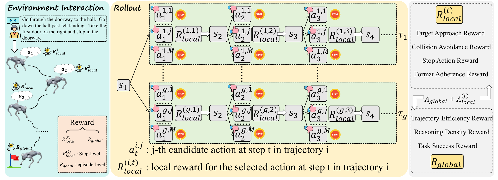
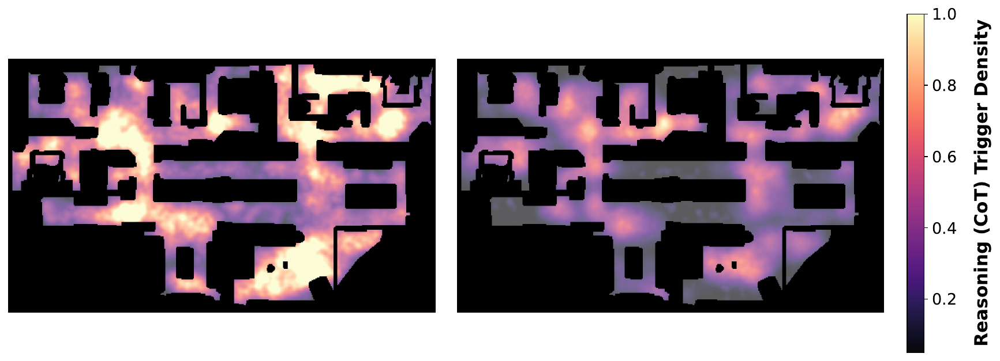
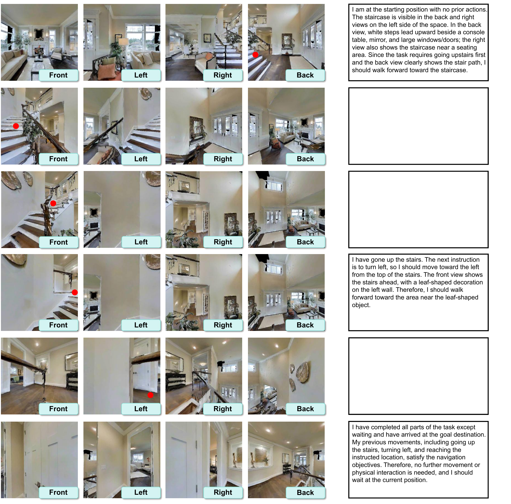
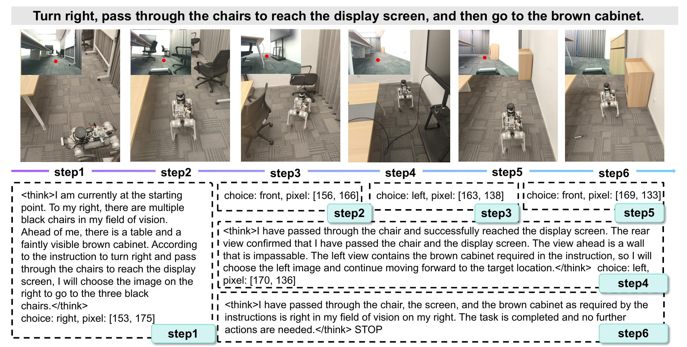
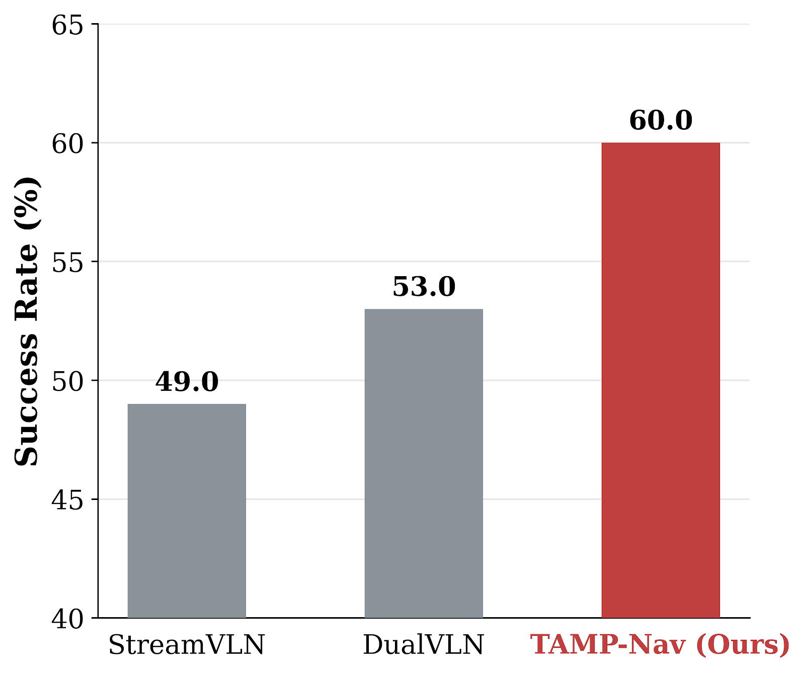

# TAMP-Nav

### Point, Think, Memorize, and Align for Efficient Embodied Navigation

Anonymous research artifact for double-blind review

[Architecture](#architecture) | [Results](#main-results) | [Analysis](#what-the-model-learns) | [Examples](#qualitative-examples)

## Overview

TAMP-Nav is a unified vision-language navigation framework that aligns high-level visual reasoning with low-level physical execution. Instead of asking a vision-language model (VLM) to regress 3D coordinates or emit long sequences of atomic actions, TAMP-Nav lets the model act as a visual pointer: it selects a camera view and a 2D pixel waypoint, which is projected into 3D and executed by a low-level SLAM controller.

The framework couples this vision-centric action space with selective reasoning, long-horizon memory, and hierarchical reinforcement learning. The resulting RGB-based navigator reasons at difficult decision points, preserves the topology of long trajectories, and learns from both immediate physical feedback and complete-task outcomes.

> **Core contribution:** TAMP-Nav unifies spatial alignment, adaptive reasoning, compact trajectory memory, and dense policy optimization in one embodied navigation framework.

## Architecture

  

<em>
TAMP-Nav combines multi-view RGB observations, language instructions, Anchor-Trajectory Memory, selective reasoning, visual waypoint prediction, and 2D-to-3D execution.
</em>

At each navigation step, the policy combines four egocentric RGB views with a compressed history. It decides whether the scene warrants explicit reasoning, predicts a view and pixel waypoint, and delegates metric execution to the controller. Depth is used only after the VLM prediction for geometric projection; it is not an input to the VLM.

| Component | Mechanism | Effect |
| --- | --- | --- |
| **Point** | Select a view and 2D pixel, then project it into 3D | Matches the VLM's 2D visual priors while leaving geometry and motion control to deterministic modules |
| **Think** | Trigger Chain-of-Thought only at critical topological nodes | Concentrates computation on crossroads, doorways, and target-relevant decisions |
| **Memorize** | Store critical states as visual-reasoning anchors and routine motion as Space-Time Indicators | Preserves long-horizon topology without retaining every visual frame |
| **Align** | Combine local process rewards with global trajectory rewards in Two-Level GRPO | Provides dense credit for useful reasoning, safe actions, efficient paths, and task completion |

### Point: visual actions, metric execution

The VLM observes four views covering 360 degrees, chooses the most relevant view, and predicts a pixel coordinate. Projecting that pixel through the aligned depth map produces a local 3D waypoint for the SLAM controller. This separation lets the learned policy focus on visual-semantic grounding rather than learning metric geometry implicitly.

### Think and Memorize: adaptive cognition over long horizons

TAMP-Nav treats reasoning events as memory anchors. A critical node retains its visual evidence, spatial-temporal state, and reasoning summary. Between anchors, redundant images are discarded and the traversed path is represented by lightweight Space-Time Indicators encoding position, orientation, and time. The resulting alternating anchor-trajectory sequence preserves both semantic landmarks and geometric connectivity.

### Align: Two-Level GRPO

  

<em>
Two-Level GRPO superimposes local action advantages and global trajectory advantages across multi-branch rollouts.
</em>

At every decision point, the policy explores several candidate visual actions and receives local feedback. Complete rollouts receive global feedback for success, path efficiency, and reasoning density. Combining both levels reduces the credit-assignment gap between a final outcome and the intermediate decisions that produced it.

| Optimization level | Signals | What it teaches |
| --- | --- | --- |
| **Local step** | Target approach, collision avoidance, stop correctness, reasoning value, output validity | Which action and reasoning choice is useful at the current state |
| **Global trajectory** | Task success, SPL, reasoning density | Whether the complete plan is successful, efficient, and cognitively economical |
| **Combined advantage** | Global advantage + local advantage | How local decisions contribute to long-term navigation quality |

## Main Results

All values below are reported in the anonymous manuscript on validation-unseen splits. Higher is better for OS, SR, SPL, and nDTW; lower is better for NE.

### R2R-CE Val-Unseen

| Method | NE (lower) | OS | SR | SPL |
| --- | ---: | ---: | ---: | ---: |
| StreamVLN | 4.98 | 64.2 | 56.9 | 51.9 |
| NavFoM | 4.61 | 72.1 | 61.7 | 55.3 |
| DualVLN | 4.05 | 70.7 | 64.3 | 58.5 |
| TAMP-Nav (SFT only) | 4.88 | 62.0 | 55.7 | 50.3 |
| **TAMP-Nav** | **3.85** | **74.5** | **66.2** | **58.8** |

### RxR-CE Val-Unseen

| Method | NE (lower) | SR | SPL | nDTW |
| --- | ---: | ---: | ---: | ---: |
| StreamVLN | 6.22 | 52.9 | 46.0 | 61.9 |
| NavFoM | 4.74 | 64.4 | 56.2 | 65.8 |
| DualVLN | 4.58 | 61.4 | 51.8 | 70.0 |
| TAMP-Nav (SFT only) | 6.10 | 52.4 | 46.2 | 62.1 |
| **TAMP-Nav** | **4.32** | **65.7** | **56.9** | **72.4** |

The full framework improves R2R-CE success from **55.7% to 66.2%** over its SFT-only initialization, a gain of 10.5 percentage points from reinforcement-learning alignment.

## What The Model Learns

### Reasoning on demand

  

<em>
Spatial density of reasoning triggers: SFT initialization (left) and RL-aligned TAMP-Nav (right).
</em>

| Trigger strategy | CoT ratio | R2R-CE SR |
| --- | ---: | ---: |
| Dense CoT | 100.0% | 66.8% |
| Fixed interval (1/3) | 36.2% | 60.1% |
| **Adaptive trigger (TAMP-Nav)** | **26.3%** | **66.2%** |

Adaptive triggering nearly matches dense reasoning while invoking CoT on roughly one quarter of the steps. Spatial analysis further shows that reasoning assigned to straight corridors falls from **38% after SFT to 11% after RL alignment**, while triggers concentrate around intersections, doorways, and target-relevant regions.

### Long-horizon memory

The long-horizon subset contains 5,927 trajectories whose expert paths exceed 12.5 meters.

| Memory or navigation variant | SR |
| --- | ---: |
| StreamVLN | 30.9 |
| DualVLN | 41.9 |
| TAMP-Nav with uniform sampling | 40.5 |
| TAMP-Nav with full history | 42.4 |
| TAMP-Nav without Space-Time Indicators | 45.6 |
| **TAMP-Nav with Anchor-Trajectory Memory** | **49.8** |

Explicit anchors preserve high-value semantic evidence, while Space-Time Indicators retain the geometry of compressed path segments. Removing the indicators reduces long-horizon SR by 4.2 percentage points.

### Efficiency, robustness, and transfer

| Evaluation | TAMP-Nav | Comparison or reference |
| --- | ---: | --- |
| Training scale | **90k trajectories / 700k interactions** | SFT cold start followed by Two-Level GRPO |
| Average policy interactions per trajectory | **9** | Approximately 30 for StreamVLN and DualVLN |
| Average inference time per task on one A800 | **16.58 s** | 37.47 s for StreamVLN; 41.46 s for DualVLN |
| SR with 0.2 multiplicative depth noise | **63.4%** | 66.2% without noise |
| Zero-shot real-world SR over 100 trials | **60.0%** | 49.0% for StreamVLN; 53.0% for DualVLN |

The Two-Level GRPO analysis reports a final success reward of **0.59** with trajectory rewards alone, **0.64** after adding local step advantages, and **0.68** with the full annealed guided-sampling strategy.

## Qualitative Examples

### Simulation

  

<em>
A simulated trajectory illustrating multi-view pixel actions and sparse reasoning at task-relevant decision points.
</em>

### Real world

  
  

<em>
Zero-shot navigation in an unmapped real-world environment and success rates over 100 trials.
</em>

## Repository Structure

| Path | Research role |
| --- | --- |
| <code>src/agent/</code> | Navigation policy, selective reasoning, action parsing, and memory |
| <code>src/model/</code> | Navigation-adapted VLM implementation |
| <code>src/train/</code> | SFT, Two-Level GRPO, and reward definitions |
| <code>src/env/</code> and <code>src/eval/</code> | Continuous navigation environment, geometry, metrics, and evaluation |
| <code>src/dataset/</code> and <code>data/</code> | MultiNav-CoT processing and an anonymized review subset |
| <code>src/server/</code> | Interfaces between the high-level policy and embodied platforms |
| <code>config/</code> and <code>scripts/</code> | Experiment configurations and research pipelines |

## Artifact Scope

This repository is an anonymous review artifact. Author identities, affiliations, acknowledgements, personal project links, and citation metadata are intentionally withheld. The full licensed simulation assets, complete training corpus, model checkpoints, manuscript, and paper source are distributed separately and are not part of this repository.
