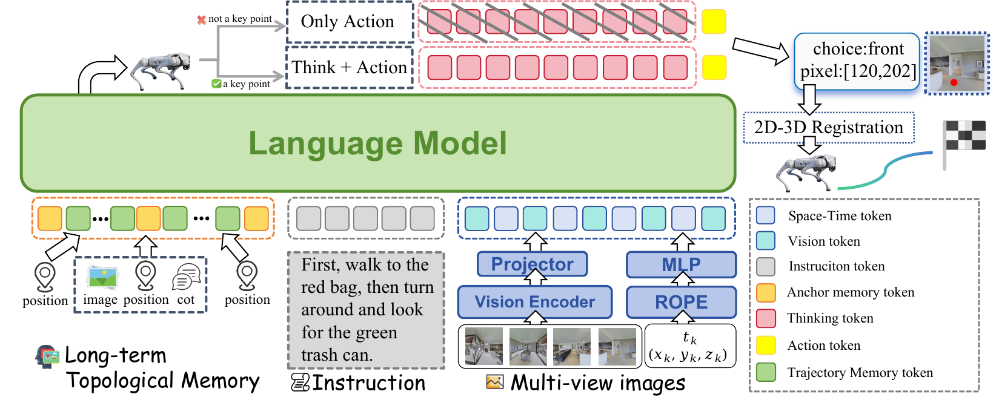

# TAMP-Nav Project Homepage — Style Guide

**Version:** 1.0  
**Last updated:** 2026-07-26  
**Purpose:** Maintain visual and structural consistency when updating the TAMP-Nav academic project homepage.

---

## Design Philosophy

The homepage follows **academic paper conventions** rather than product marketing patterns. The aesthetic is clean, serif-led, and content-focused. Think NeurIPS/ICLR project pages, not SaaS landing pages.

### Core Principles

1. **Numbered sections, figures, and tables** — Match manuscript structure
2. **Centered abstract with serif typography** — Traditional academic layout
3. **Neutral palette** — White background, light gray bands, earth-tone accents
4. **Minimal decoration** — Let research content lead
5. **Accessibility-first** — Semantic HTML, ARIA labels, keyboard navigation

---

## Color Palette

```css
/* Primary */
--bg:         #ffffff     /* Page background */
--text:       #1a1a1a     /* Body text */
--muted:      #666666     /* Secondary text */
--line:       #e5e7eb     /* Borders, dividers */

/* Accent (warm earth tones) */
--accent:     #b96420     /* Primary accent (rust) */
--accent-bg:  #fef9f5     /* Soft tan background for notes */
--accent-dk:  #2b1d14     /* Dark brown for emphasis */

/* Interactive */
--link:       #2563eb     /* Links (blue) */
--link-hover: #1e40af     /* Link hover state */
```

**When to use each:**
- `--accent` (rust) — Borders for callouts, section numbers, active nav
- `--accent-bg` (tan) — Background for contribution notes, important callouts
- `--accent-dk` (dark brown) — Strong emphasis within accent blocks
- Never use marketing colors (green CTAs, purple gradients, multi-color brands)

---

## Typography

### Font Stacks

```css
/* Serif — headings, abstract, figure captions */
--serif: Georgia, "Times New Roman", Times, serif;

/* Sans-serif — body text, tables, UI */
--sans: Inter, -apple-system, BlinkMacSystemFont, "Segoe UI", Roboto, 
        "Helvetica Neue", Arial, sans-serif;

/* Monospace — code, BibTeX */
--mono: "SF Mono", Monaco, "Cascadia Code", "Roboto Mono", 
        Consolas, "Courier New", monospace;
```

### Scale

```css
/* Headings */
h1: 42px, --serif, 700         /* Paper title */
h2: 28px, --serif, 600         /* Section titles */
h3: 20px, --serif, 600         /* Subsection titles */

/* Body */
p:  16px, --sans, 400, 1.6     /* Standard text */
abstract: 17px, --serif, 1.75  /* Abstract body */

/* UI */
.section-number: 16px, --serif, italic  /* Section label */
.fig-label: inherit, 600                /* Figure/Table label */
.table-caption: 15px, --sans, 1.5       /* Table caption */
```

### Typographic Rules

- **Headings** use `--serif` and sentence case ("Qualitative results" not "Qualitative Results")
- **Abstract** is justified serif text in a centered 760px column
- **Figure/table labels** are bolded inline (`<span class="fig-label">Figure 3.</span>`)
- **Captions** follow labels in regular weight, same font
- **Section numbers** are italic serif, displayed above each `h2`

---

## Layout Patterns

### Page Structure

```html
<body>
  <header class="site-header">
    <!-- Title, authors, affiliations, resource links -->
  </header>
  
  <nav class="site-nav" aria-label="Page sections">
    <!-- Sticky scroll-spy navigation -->
  </nav>
  
  <main>
    <section class="section" id="abstract">
      <div class="page-width">
        <div class="section-head">
          <p class="section-number">1</p>
          <h2>Abstract</h2>
        </div>
        <div class="abstract-body">
          <!-- Content -->
        </div>
      </div>
    </section>
    
    <section class="section section-alt" id="method">
      <!-- Alternating gray background -->
    </section>
    
    <!-- Repeat for each section -->
  </main>
  
  <footer class="site-footer">
    <!-- Minimal footer -->
  </footer>
</body>
```

### Grid Systems

**Page width:** 1200px max, responsive breakpoints at 768px and 480px

```css
.page-width {
  max-width: 1200px;
  margin: 0 auto;
  padding: 0 24px;
}

/* Two-column layouts (method figures, real-world grid) */
.two-col {
  display: grid;
  gap: 32px;
  grid-template-columns: repeat(2, minmax(0, 1fr));
}

@media (max-width: 768px) {
  .two-col { grid-template-columns: 1fr; }
}
```

**Evidence grid** (4 columns, responsive to 2 then 1):

```css
.evidence-grid {
  display: grid;
  grid-template-columns: repeat(4, minmax(0, 1fr));
  border-top: 1px solid var(--line);
  border-bottom: 1px solid var(--line);
}

@media (max-width: 768px) {
  .evidence-grid { grid-template-columns: repeat(2, 1fr); }
}
@media (max-width: 480px) {
  .evidence-grid { grid-template-columns: 1fr; }
}
```

---

## Component Patterns

### Section Header

Every section starts with this structure:

```html
<div class="section-head">
  <p class="section-number">3</p>
  <h2 id="results-title">Main Results</h2>
  <p class="section-summary">
    State-of-the-art success rates on R2R-CE and RxR-CE val-unseen splits.
  </p>
</div>
```

**Rules:**
- Section number in italic serif
- Heading ID matches nav anchor (`id="results"` → `<a href="#results">`)
- Summary is optional, use for 1-sentence context

### Figures with Lightbox

```html
<figure class="example-figure">
  <button
    class="figure-button"
    type="button"
    data-lightbox="img/architecture.png"
    data-caption="Figure 1. TAMP-Nav combines multi-view RGB..."
    aria-label="Open Figure 1, the architecture diagram, at full size"
    title="Open full-size figure"
  >
    
    <span class="zoom-mark" aria-hidden="true">+</span>
  </button>
  <figcaption>
    <span class="fig-label">Figure 1.</span>
    TAMP-Nav combines multi-view RGB observations, language instructions,
    Anchor-Trajectory Memory, selective reasoning, visual waypoint prediction,
    and 2D-to-3D execution.
  </figcaption>
</figure>
```

**Rules:**
- Always include `data-lightbox`, `data-caption`, `aria-label`, `title`
- `alt` text describes the visual content (not redundant with caption)
- Figure label is `<span class="fig-label">` followed by caption text
- `loading="lazy"` for below-the-fold images

### Tables

```html
<p class="table-caption">
  <span class="tab-label">Table 2.</span>
  Performance on R2R-CE val-unseen. Higher is better for OS, SR, SPL;
  lower is better for NE.
</p>
<div class="table-scroll compact-table" tabindex="0">
  <table>
    <thead>
      <tr>
        <th scope="col">Method</th>
        <th scope="col">NE&nbsp;↓</th>
        <th scope="col">OS&nbsp;↑</th>
        <th scope="col">SR&nbsp;↑</th>
        <th scope="col">SPL&nbsp;↑</th>
      </tr>
    </thead>
    <tbody>
      <tr><th scope="row">StreamVLN</th><td>4.98</td><td>64.2</td><td>56.9</td><td>51.9</td></tr>
      <tr><th scope="row">NavFoM</th><td>4.61</td><td>72.1</td><td>61.7</td><td>55.3</td></tr>
      <tr class="baseline"><th scope="row">TAMP-Nav (SFT only)</th><td>4.88</td><td>62.0</td><td>55.7</td><td>50.3</td></tr>
      <tr class="ours"><th scope="row">TAMP-Nav</th><td>3.85</td><td>74.5</td><td>66.2</td><td>58.8</td></tr>
    </tbody>
  </table>
</div>
```

**Rules:**
- Caption above table with `<span class="tab-label">Table N.</span>`
- `<th scope="col">` for column headers, `<th scope="row">` for row labels
- Directional arrows (`↑` / `↓`) with non-breaking space
- `.baseline` row in italic (SFT-only or ablation baseline)
- `.ours` row with soft green background (`#f0fdf4`)
- Wrap table in `.table-scroll` for horizontal scroll on mobile
- Add `compact-table` class for tighter spacing when needed

### Callout Boxes

**Contribution note** (system architecture transparency):

```html
<p class="contribution-note">
  <strong>Note on system architecture.</strong> TAMP-Nav is a complete
  navigation system. While the VLM observes RGB only, the full pipeline
  uses depth for pixel-to-3D projection...
</p>
```

**Block note** (table annotation):

```html
<p class="block-note">
  Adaptive triggering nearly matches dense reasoning while invoking CoT
  on roughly one quarter of the steps.
</p>
```

**Evidence strip** (metrics row):

```html
<div class="evidence-strip">
  <div class="evidence-grid">
    <div>
      <dt>90k / 700k</dt>
      <dd>training trajectories / interactions</dd>
      <dd class="evidence-note">
        763k trajectories for DualVLN; 3.37M interactions for NavFoM
      </dd>
    </div>
    <!-- Repeat for 4 columns -->
  </div>
</div>
```

**Video placeholder** (deployment videos):

```html
<div class="video-placeholder">
  <div class="placeholder-content">
    <p class="placeholder-label">Deployment Videos</p>
    <p class="placeholder-text">
      Representative navigation trials on the Unitree Go2 quadruped will
      be published here upon acceptance...
    </p>
  </div>
</div>
```

---

## Interactive Elements

### Resource Links (Header)

```html
<a class="resource-link disabled" href="#" aria-disabled="true">
  <svg>...</svg>
  Paper <em>withheld during review</em>
</a>

<a class="resource-link" href="#artifact">
  <svg>...</svg>
  Code <em>in this artifact</em>
</a>
```

**Rules:**
- Black pill buttons with icon + label
- `.disabled` class grays out unavailable links
- `aria-disabled="true"` for screen readers

### BibTeX Copy Button

```html
<button class="copy-button" type="button" aria-label="Copy BibTeX to clipboard">
  <svg class="icon-copy">...</svg>
  <svg class="icon-check">...</svg>
  <span class="button-text">Copy</span>
</button>
```

**Behavior:**
- On click, copies BibTeX to clipboard
- Button flips to "Copied ✓" for 2 seconds
- Falls back to `execCommand('copy')` if Clipboard API unavailable

### Scroll-Spy Navigation

```html
<nav class="site-nav" aria-label="Page sections">
  <div class="nav-inner">
    <a href="#abstract" class="is-active">Abstract</a>
    <a href="#method">Method</a>
    <a href="#results">Results</a>
    <!-- ... -->
  </div>
</nav>
```

**Behavior:**
- Sticky positioning (`position: sticky; top: 72px`)
- `.is-active` class added to current section link as user scrolls
- Smooth scroll on click (`scroll-behavior: smooth` on `<html>`)

---

## Content Guidelines

### Writing Style

- **Concise, technical, and precise** — Write for ML researchers
- **No marketing language** — "State-of-the-art results" not "Revolutionary breakthrough"
- **Passive voice for methods** — "The policy is trained..." not "We train..."
- **Active voice for contributions** — "TAMP-Nav achieves 66.2% SR"
- **Abbreviations** — Define on first use, then use consistently (VLM, CoT, GRPO, SPL)

### Number Formatting

```
Percentages:     66.2% (no space)
Metrics:         3.85 (consistent decimal places per metric)
Large numbers:   90,000 or 90k (pick one style per context)
Ranges:          12.5–15.0 (en dash, no spaces)
Coordinates:     [u, v] or (x, y, z) (consistent brackets)
```

### Cross-References

- **Figures:** "Figure 3 shows..." (not "Fig. 3" or "the figure below")
- **Tables:** "Table 2 reports..." (not "Tab. 2")
- **Sections:** "See Section 4.4" or "detailed in the manuscript (Appendix D)"
- **Equations:** "Equation 8" or "the annealed guided sampling strategy (§3.3)"

---

## Accessibility Requirements

### Semantic HTML

- Use `<header>`, `<nav>`, `<main>`, `<section>`, `<article>`, `<footer>`
- All sections have unique IDs matching nav anchors
- Headings follow logical hierarchy (h1 → h2 → h3, no skipping)
- Tables use `<th scope="col">` and `<th scope="row">`
- Forms use `<label>` with `for` attribute

### ARIA Labels

```html
<nav aria-label="Page sections">
<button aria-label="Copy BibTeX to clipboard">
<a aria-label="Open Figure 1 at full size">
<a class="resource-link disabled" aria-disabled="true">
<div class="table-scroll" tabindex="0">  <!-- keyboard scrollable -->
```

### Keyboard Navigation

- All interactive elements reachable via Tab
- Focus visible (`:focus-visible` ring, never `outline: none` without replacement)
- Lightbox closable via Escape key
- Skip link at top (`<a href="#main" class="skip-link">Skip to main content</a>`)

### Color Contrast

All text meets WCAG AA:
- Body text: #1a1a1a on #ffffff (15.8:1)
- Muted text: #666666 on #ffffff (5.7:1)
- Links: #2563eb on #ffffff (7.5:1)
- Accent: #b96420 on #fef9f5 (5.2:1)

---

## File Structure

```
docs/
├── index.html              # Main page
├── assets/
│   ├── site.css            # All styles (no preprocessor)
│   └── site.js             # Lightbox + BibTeX copy + scroll-spy
├── img/
│   ├── architecture.png
│   ├── two_level_grpo.png
│   ├── reasoning_heatmap.png
│   ├── simulation_trajectory.png
│   ├── real_world_trajectory.png
│   └── real_world_success.png
└── STYLE_GUIDE.md          # This file
```

**Asset guidelines:**
- Images: PNG or JPG, width 1600–2400px, optimized with `pngcrush` or `jpegoptim`
- CSS: Single file, organized by component, comments for each section
- JS: Vanilla JavaScript, no frameworks, ES6+ syntax

---

## When Adding New Content

### Adding a Figure

1. Save image to `docs/img/` with descriptive name
2. Use the figure template (see "Figures with Lightbox" above)
3. Increment figure number sequentially
4. Add to lightbox gallery (`data-lightbox` attribute)
5. Write alt text describing visual content
6. Caption format: `<span class="fig-label">Figure N.</span> Description.`

### Adding a Table

1. Use the table template (see "Tables" above)
2. Caption above table with `<span class="tab-label">Table N.</span>`
3. Add directional arrows to column headers when appropriate
4. Mark baseline rows with `.baseline` class (italic)
5. Mark final method row with `.ours` class (soft green background)
6. Ensure consistent decimal places per column

### Adding a Section

1. Increment section number sequentially
2. Add nav link to `<nav class="site-nav">`
3. Use `.section-alt` class to alternate gray background
4. Follow section header template
5. Update scroll-spy threshold in JS if needed

### Adding a Callout

- **System note:** Use `.contribution-note` (tan background, rust border)
- **Table annotation:** Use `.block-note` (muted text, no background)
- **Evidence row:** Use `.evidence-strip` + `.evidence-grid`
- **Placeholder:** Use `.video-placeholder` (dashed border, centered text)

---

## Testing Checklist

Before committing changes:

- [ ] HTML validates (W3C validator)
- [ ] All links resolve (no 404s)
- [ ] Images load and have correct dimensions
- [ ] Lightbox opens/closes correctly
- [ ] BibTeX copy button works
- [ ] Scroll-spy nav highlights active section
- [ ] Mobile responsive (test at 768px, 480px)
- [ ] Keyboard navigation works (Tab, Enter, Escape)
- [ ] Screen reader announces sections correctly
- [ ] Color contrast meets WCAG AA
- [ ] All numbers cross-checked against manuscript

---

## Common Mistakes to Avoid

1. **Don't** add marketing language ("game-changing", "cutting-edge")
2. **Don't** use purple gradients, green CTAs, or multi-brand colors
3. **Don't** skip figure/table labels or use inconsistent numbering
4. **Don't** write alt text that duplicates the caption
5. **Don't** break the heading hierarchy (h1 → h3 without h2)
6. **Don't** remove ARIA labels or keyboard focus indicators
7. **Don't** inline critical CSS (keep all styles in site.css)
8. **Don't** add JavaScript dependencies (keep vanilla JS)
9. **Don't** use absolute units for responsive elements (px for max-width, rem for text)
10. **Don't** commit unoptimized images (compress before adding)

---

## Version History

| Version | Date       | Changes |
|---------|------------|---------|
| 1.0     | 2026-07-26 | Initial style guide documenting post-review homepage refactor |

---

**Maintainer note:** This style guide reflects the homepage as of commit `1483af0`. When making updates, preserve the academic paper aesthetic, numbered structure, and accessibility standards documented here.
